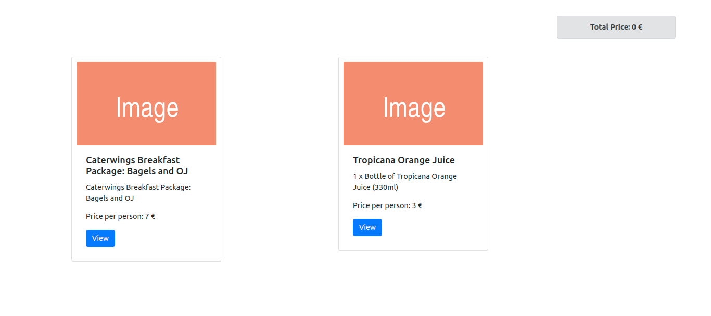
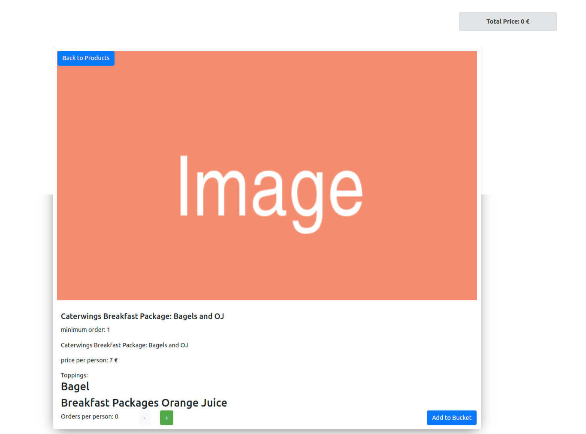

# FOOD-SALE

The project for online shopping food market build by `create react app` & `npm` packages & `bootstrap` & `sass` and `jest` for test cases.

# Getting Started

These instructions will get you a copy of the project up and running on your local machine for development and testing purposes. And the deployment to AWS cloud.

## Prerequisites

The project needs to have node running on your machine you can download it [here](https://nodejs.org/en/).

or use `nvm` by Terminal:

Ensure that nvm was installed correctly with

```
nvm --version
```

Install the version of Node.js you want

- Install the latest version with

```
 nvm install node
```

- Use the latest version with

```
 nvm use node
```

## Installing

for the installation clone git repo or fork it [here](https://github.com/Osman190/food-sale)

```
git clone https://github.com/Osman190/food-sale.git
```

then for the packages run

```
npm install
```

# Running the tests

To run the tests units open different terminal tap and run the command:
the tests should pass for the functions and jsx elements are existing

```
npm run jest
```

# Deployment

For the deployment we are going to use AWS. the instructions for it comes later

# Built With

- [React](https://reactjs.org/docs/create-a-new-react-app.html) - The web popular framework.
- [Bootstrap](https://getbootstrap.com/) - The style popular framework.
- [SASS](https://sass-lang.com/) - The style Sheet
- [AWS](https://aws.amazon.com/) - The cloud server




